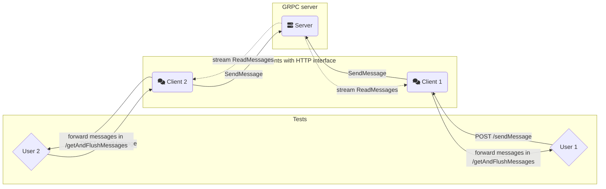
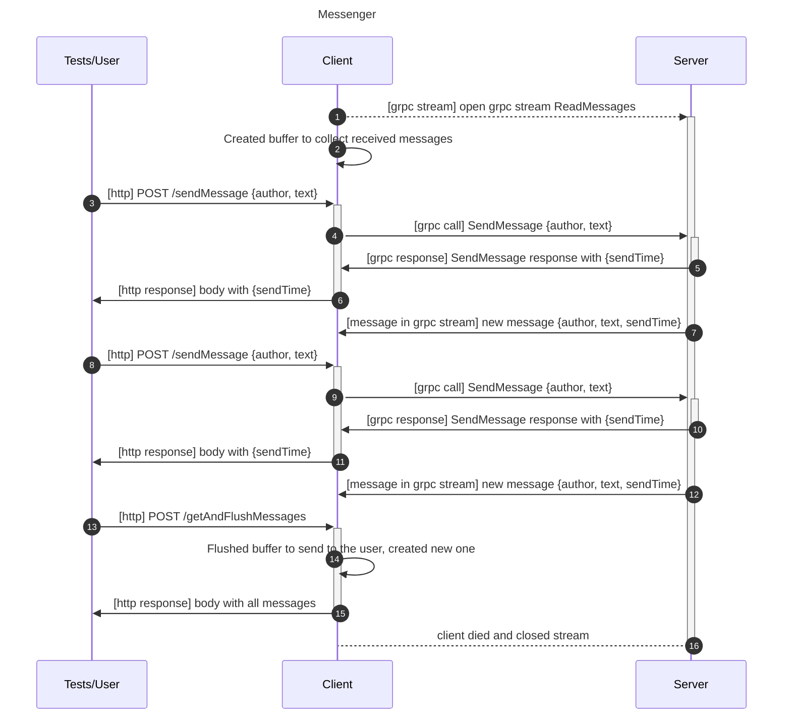

# Практика gRPC

## Мессенджер с одним чатом

В рамках проекта реализованы сервер и клиент мессенджера с одним общим чатом. У сервера есть два RPC-метода: послать сообщение в чат (SendMessage) и подключиться к чату и получать бесконечный поток сообщений из чата (ReadMessages).
Клиент при включении открывает поток и скапливать в своём буфере пришедшие сообщения. Также через клиент отправляются сообщения в чат с помощью http интерфейса.

Ниже представлена диаграмма коммуникации с одним серверов, двумя клиентами и двумя пользователями:


### Коммуникация между компонентами

На диаграмме ниже представлена последовательность вызовов и ответов между компонентами. Чтобы не переусложнять диаграмму, на ней представлен только один клиент, паттерн коммуникации при двух и более не отличается.



### Интерфейс взаимодействия пользователя с клиентом

Пользователи отправляют на сервер+клиент запросы клиенту, который представляет собой HTTP сервер, поддерживающий два вида запросов:

```
POST /sendMessage
Отправляет одно сообщение в общий чат.
Body:
{
    "author": "Ivan Ivanov",
    "text": "Hey guys"
}

Response:
{
    "sendTime": "..."
}

POST /getAndFlushMessages
Возвращает буферизированные сообщения, удаляя их из буфера.
Response:
[{
    "author": "Ivan Ivanov",
    "text": "Hey guys",
    "sendTime": "..."
},{
    "author": "Petr Petrov",
    "text": "Hey Ivan",
    "sendTime": "..."
}]
```

Примеры с curl:
```
$ curl -X POST localhost:8080/sendMessage -d '{"author": "alice", "text": "hey"}'
{"sendTime":"2021-09-12T10:25:22.454093428Z"}


$ curl -X POST localhost:8080/getAndFlushMessages
[{"author":"alice","text":"hey","sendTime":"2021-09-12T10:25:22.454093428Z"},{"author":"alice","text":"hey guys","sendTime":"2021-09-12T10:25:41.296997047Z"}]
```

